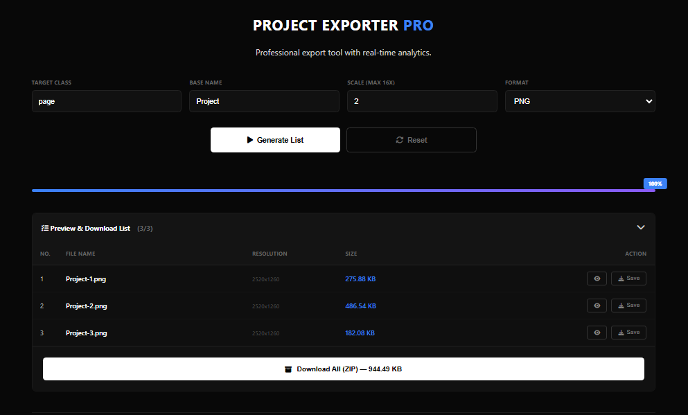

# 📸 Project Exporter Pro



### Universal Web Element Export Engine
> Drop a single `<script>` tag into any HTML project — a fully-featured, premium export UI appears automatically. No extra HTML, no CSS file, no configuration required.

---

## 📑 Table of Contents

- [🚀 Overview](#-overview)
- [✨ Feature Breakdown](#-feature-breakdown)
- [📦 Supported Formats](#-supported-formats)
- [⚙ Configuration Options](#-configuration-options)
- [🛠 Installation](#-installation)
- [🔄 How It Works](#-how-it-works)
- [⚡ Performance Notes](#-performance-notes)
- [📂 File Structure](#-file-structure)
- [👨‍💻 Author](#-author)
- [⭐ Support](#-support)

---

## 🚀 Overview

**Project Exporter Pro** is a self-contained JavaScript export engine designed to be injected into any HTML project without touching existing code.

It automatically:
- Injects its own full UI (dark premium theme)
- Loads all required external libraries via CDN
- Detects target DOM elements by CSS selector
- Captures them using the **html-to-image** engine (SVG foreignObject — native browser CSS renderer)
- Generates downloadable files in multiple formats
- Provides live preview, table listing, and ZIP packaging

> One JS file. Zero setup. Works everywhere.

---

## ✨ Feature Breakdown

### 🎨 Premium Dark Interface
Fully injected, Shadow DOM isolated — zero style conflict with your project.

### 📊 Live Progress System
Animated progress bar, percentage badge, and real-time item counter.

### ⏯ Pause / Resume / Stop
Full process control without reloading the page.

### 🔢 Flexible Scale Control
Number input supporting **0.25× to 32×** with live colour feedback:

| Range | Theme | Meaning |
|-------|-------|---------|
| 0.25× – 8× | 🔵 Blue | Safe for everyday use |
| > 8× – 16× | 🟡 Amber | High memory usage warning |
| > 16× | 🔴 Red | Extreme — may crash browser |

### 📖 Documentation Popup
A `📄` icon in the header opens a GitHub-style README viewer that fetches the latest documentation live from GitHub.

### 👁 Image Preview Modal
Preview any generated image before downloading.

### 📦 ZIP Packaging
Download all exported images as a single `.zip` file.

### ✂ Smart Filename Truncation
Long filenames are automatically truncated with middle ellipsis, adaptive for mobile and desktop.

### 📱 Fully Responsive
Grid layout adapts: 1 column → 2 → 4 based on screen width.

### 🧹 Memory Cleanup
All object URLs are revoked on reset to prevent memory leaks.

---

## 📦 Supported Formats

| Format | Description |
|--------|-------------|
| **PNG** | Lossless, supports transparency |
| **JPG** | Compressed, smaller file size |
| **WebP** | Modern format, best compression |
| **SVG** | Vector — scalable, text-based |
| **PDF (RGB)** | Screen-optimised PDF |
| **PDF (CMYK)** | Print-ready PDF with CMYK colour conversion |
| **CMYK JPEG** | Print-accurate JPEG with CMYK pixel conversion |

> **CMYK formats** convert each pixel from RGB to CMYK colour space and back — producing colour-accurate output for professional print workflows.

---

## ⚙ Configuration Options

| Field | Description | Default |
|-------|-------------|---------|
| Target Selector | CSS selector of elements to export | `.page` |
| Base Name | Output filename prefix | `Export` |
| Scale | Rendering multiplier (0.25× – 32×) | `2` |
| Format | Output format | `PNG` |

---

## 🛠 Installation

### Option 1 — Local file

1. Download `export.js`
2. Place it in your project folder
3. Add this before the closing `</body>` tag:

```html
<script src="./export.js"></script>
```

### Option 2 — CDN / GitHub Pages *(Recommended)*

Just paste this anywhere in your HTML:

```html
<script src="https://muhtasim-rahman.github.io/exporter-pro/export.js"></script>
```

That's it. The export UI appears at the bottom of the page.

---

## 🔄 How It Works

```
User sets selector, name, scale, format
         ↓
DOM query — finds all matching elements
         ↓
Each element is cloned off-screen
(above viewport, overflow:visible)
         ↓
html-to-image captures at exact W×H
(no viewport clipping — full fidelity)
         ↓
CMYK conversion applied if needed
         ↓
Blob / PDF generated
         ↓
Table row added: preview + download button
         ↓
ZIP available for all image formats
```

---

## ⚡ Performance Notes

- **Recommended scale:** 2× – 4× for everyday use
- Scales above 8× significantly increase memory and processing time
- Scales above 16× may crash the browser tab — use with caution
- PDF files are downloaded immediately via jsPDF; they are not included in the ZIP
- SVG output is vector-based and scale-independent
- Requires an **internet connection** for CDN libraries (html-to-image, JSZip, jsPDF, marked.js)
- If your project includes cross-origin images, host it on a server (e.g. GitHub Pages) to avoid CORS issues

---

## 📂 File Structure

```
your-project/
├── index.html
├── export.js       ← drop this in, nothing else needed
└── ...
```

---

## 👨‍💻 Author

**Muhtasim Rahman (Turzo)**
> Programmer · Web Developer · Graphic Designer · Student

| | |
|---|---|
| 🌐 Portfolio | https://mdturzo.odoo.com |
| 🐙 GitHub | https://github.com/muhtasim-rahman |
| 💼 LinkedIn | https://www.linkedin.com/in/mdturzo999 |
| ▶ YouTube | https://www.youtube.com/@mdturzo999 |
| ✉ Email | programmer.turzo@gmail.com |

---

## ⭐ Support

If this project helped you:

- ⭐ **Star** the repository
- 🍴 **Fork** it and build on top
- 🐛 **Open an issue** if you find a bug
- 💡 **Submit a PR** if you have an improvement

---

Made with 💖 by [Muhtasim Rahman](https://mdturzo.odoo.com)
